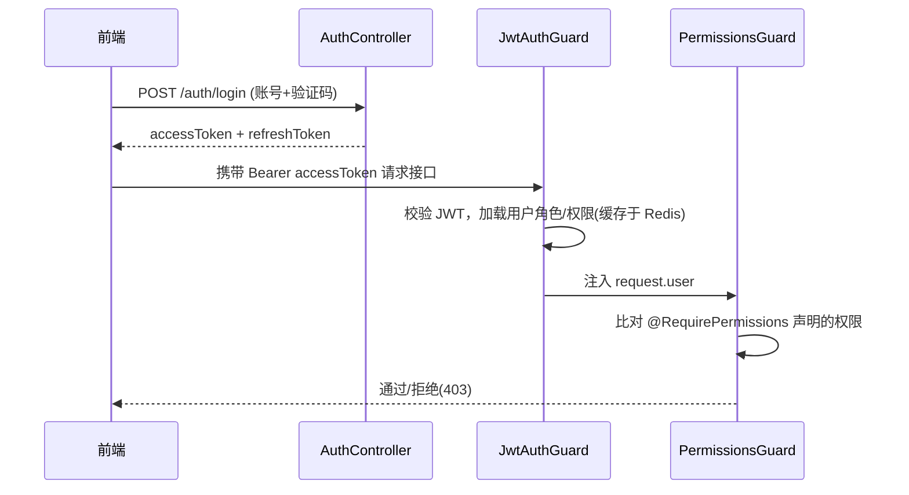

# 架构说明

nice-admin 是一个 pnpm monorepo 管理的全栈后台系统，分为前端、后端、共享包三部分，通过 Docker Compose 一键部署。

## 技术栈

| 层 | 技术 |
| --- | --- |
| 前端 | React 18、Vite、TypeScript、Ant Design 5、TailwindCSS、Zustand、TanStack Query、React Router v6、ECharts、i18next、socket.io-client |
| 后端 | NestJS 10、TypeScript、Prisma ORM、PostgreSQL、Redis(ioredis)、Passport-JWT、class-validator、Swagger、@nestjs/schedule、Socket.io、svg-captcha、systeminformation |
| 部署 | Docker 多阶段构建、Nginx、docker-compose |

## 目录结构

```
nice-admin/
├─ apps/
│  ├─ web/                  # React 前端
│  │  └─ src/
│  │     ├─ api/            # axios 封装 + 接口定义
│  │     ├─ components/     # 通用组件（Access 权限、FormRenderer 低代码渲染）
│  │     ├─ hooks/          # useSocket 等
│  │     ├─ layout/         # 主框架布局（侧边栏/头部）
│  │     ├─ pages/          # 业务页面（按菜单 component 路径组织）
│  │     ├─ router/         # 动态路由生成
│  │     ├─ store/          # zustand 状态（auth/app/menu）
│  │     └─ i18n/           # 多语言
│  └─ api/                  # NestJS 后端
│     ├─ prisma/            # schema + seed
│     └─ src/
│        ├─ common/         # 拦截器/过滤器/守卫/装饰器/工具
│        ├─ config/         # 配置加载
│        ├─ prisma/         # PrismaService（全局）
│        ├─ redis/          # RedisService（全局）
│        └─ modules/        # 业务模块（每个域一个目录）
├─ packages/shared/         # 前后端共享类型/常量
└─ docker/                  # Dockerfile / nginx
```

## 整体数据流

```mermaid
flowchart LR
  Browser[React SPA] -->|HTTP /api| Nginx
  Browser -.->|WebSocket| Nginx
  Nginx -->|proxy| Api[NestJS]
  Api -->|Prisma| PG[(PostgreSQL)]
  Api -->|cache/captcha| Redis[(Redis)]
  Api -->|@nestjs/schedule| Cron[定时任务]
```

## 认证与鉴权链路



- **全局守卫**：`JwtAuthGuard`（除 `@Public()` 外全部需登录）+ `PermissionsGuard`（按 `@RequirePermissions` 校验）。
- **超级管理员**：`isSuperAdmin=true` 拥有 `*:*:*`，绕过所有权限校验。
- **权限缓存**：用户角色与权限标识缓存在 Redis（`user:auth:{id}`，30 分钟），角色/菜单变更时清除。
- **令牌刷新**：access 过期后，前端用 refreshToken 静默换取新令牌（见 `apps/web/src/api/http.ts`）。

## 统一响应与异常

所有响应经 `TransformInterceptor` 包装为 `{ code, message, data, timestamp }`；异常由 `AllExceptionsFilter` 统一处理。前端 axios 拦截器据此解包并提示错误。

## 数据权限（DataScope）

角色可配置数据范围：全部 / 本部门 / 本部门及以下 / 仅本人 / 自定义部门。用户列表查询时由 `UserService.resolveViewableDeptIds` 计算可见部门集合并注入查询条件。
