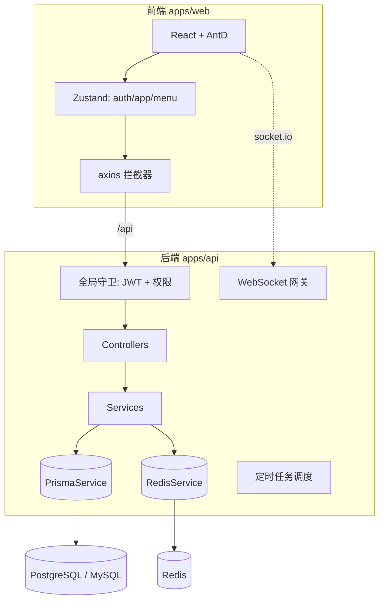
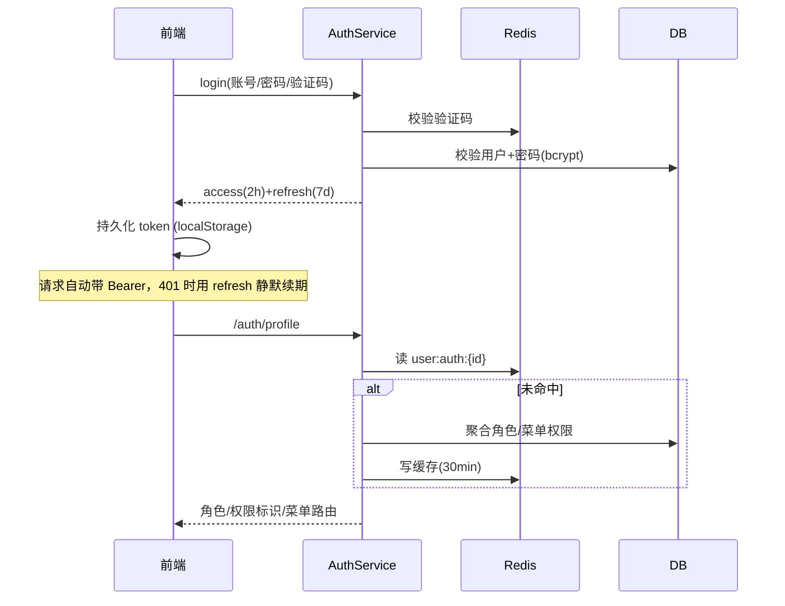
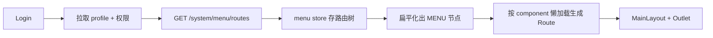

# 设计文档

本文从工程视角说明 nice-admin 的整体设计、关键决策与约定，便于后续维护与扩展。

## 1. 设计目标

| 目标 | 落地手段 |
| --- | --- |
| UI/交互出色 | Ant Design 5 + 暗色/主题色切换 + ECharts + 动态菜单/面包屑 |
| 极强扩展性 | 模块化后端、插件式菜单路由、代码生成器、低代码表单 |
| 部署便捷 | pnpm monorepo + Docker Compose 一键部署 + db push 自动建表 |
| 性能出色 | Redis 缓存权限/字典、Vite 分包、Prisma 连接池、查询分页 |
| 多数据源 | provider 可切换(PostgreSQL/MySQL) + 额外数据源扩展方案 |

## 2. 总体架构

## 3. 分层与职责

- **Controller**：参数校验(class-validator)、权限声明(`@RequirePermissions`)、操作日志(`@OperLog`)。
- **Service**：业务逻辑、事务、数据权限过滤、缓存读写。
- **PrismaService / RedisService**：全局单例（`@Global`），统一连接管理。
- **横切层(common)**：
  - `TransformInterceptor` 统一响应信封 `{code,message,data,timestamp}`
  - `AllExceptionsFilter` 统一异常
  - `OperLogInterceptor` 自动记录操作日志
  - `JwtAuthGuard` / `PermissionsGuard` 全局鉴权与按钮级权限
  - 装饰器：`@Public` `@RequirePermissions` `@CurrentUser` `@OperLog`

## 4. 认证授权设计

- **权限模型**：用户 N:N 角色，角色 N:N 菜单；菜单含 `BUTTON` 类型承载按钮权限标识（`模块:业务:动作`）。
- **超级管理员**：`isSuperAdmin` 拥有 `*:*:*`，跳过所有校验。
- **数据权限**：角色 `dataScope` ∈ {ALL, DEPT, DEPT_AND_CHILD, SELF, CUSTOM}，在查询时计算可见部门集合。
- **缓存失效**：用户/角色/菜单变更后清 `user:auth:*`。

## 5. 前端动态路由设计

- 后端按用户权限返回菜单树；前端 `import.meta.glob('../pages/**')` 收集页面，按菜单 `component` 字段（如 `system/user/index`）懒加载。
- 新增页面**无需改路由表**：建好页面文件 + 在菜单管理配置 component 即可。

## 6. 扩展点（极强扩展性核心）

1. **新增后端模块**：在 `modules/<name>/` 建 module/service/controller/dto，注册到 `app.module.ts`。横切能力自动生效。
2. **代码生成器**：录入表结构 → 预览并产出后端 CRUD + 前端页面代码。
3. **低代码表单**：可视化设计 schema，`FormRenderer` 运行时渲染。
4. **定时任务**：在 `job.handlers.ts` 注册处理器，后台配置 cron。
5. **多数据源**：见 `docs/database.md`。

## 7. 关键工程决策与注意事项

- **shared 包**：前后端共享类型/常量；因后端运行时会 `require` 其中的枚举/常量，shared 需编译为 `dist`（根脚本与 Dockerfile 已串联 `build:shared`）。
- **Nest 构建范围**：仅 `src`（`rootDir=src`），种子脚本用 `tsconfig.seed.json` 单独编译为 `dist/prisma/seed.js`，避免 `dist/main.js` 路径偏移。
- **prisma CLI**：作为 runtime 依赖，支持容器内 `db push`。
- **DB provider**：由 `set-db-provider.mjs` 在生成前写入 schema，Docker 通过构建参数 `DB_PROVIDER` 决定。
- **响应约定**：业务码 `code=0` 表示成功（见 `packages/shared` 的 `BizCode`）。

## 8. 性能策略

- 权限、字典走 Redis 缓存；分页查询统一走 `PaginationDto`。
- 前端按 react/antd/echarts 手动分包（见 `vite.config.ts`）。
- TanStack Query 做请求缓存与去重；列表 staleTime 30s。
